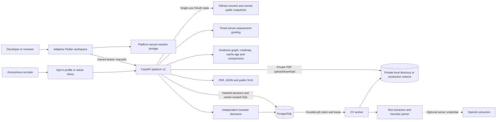

# Auctor architecture

Active entrypoint: `lib/main.dart` → `lib/premium/app.dart`; legacy frontend modules remain unmounted migration reference. FastAPI mounts `app/platform.py`; old arbitrary-user/score-verification routers are unmounted.

## Data and trust boundaries

- PostgreSQL stores owned users, hashed 30-day sessions, jobs, append-only CV revisions, evidence, attempts, formula v1 score/input history, activity/read flags, shares, saved profiles, OAuth state and reviewer snapshots. Additive migrations preserve MVP records; the seeded demo has no claimable authenticated account.
- PDFs have random server storage keys and owner/reviewer download authorization. Production requires an existing private volume, path containment/write access, explicit HTTPS origins and exact CORS. Development uses ignored `_data`; backups need separate hosting validation.
- Workers claim queued jobs with row locks/lease tokens and commit only while that lease remains active. Cancel/retry/restart recovery preserve current CV integrity. Extraction stays unverified; confidence is qualitative review guidance.
- OAuth records account ID/owned public snapshots and discards access tokens. Repository binding establishes provenance, not code quality. Analytics label cache age and limited event scope; reconnect refreshes.
- Server attempts own question IDs, deadline, submitted answers, outcome and actual delta. Replay returns the original result; failed retries preserve badges. Details expose owned results without pre-submission answer keys.
- `app/insights.py` derives real CV/project/assessment edges and prioritized gaps. Declared technologies, owned provenance and scoped assessments stay distinct; unsupported skills never get invented tests. History records evidence snapshots and labels missing old baselines.
- Private operator grants enable independent reviewers. Decisions preserve reviewer/time/source/issuer/rationale after evidence removal. Self-review and approved-proof replacement are refused. Coding JSON imports are user-supplied/hashed/unverified until reviewed.
- Public/share payloads omit private contact/source bytes. Discovery is opt-in; private links revoke independently. Authenticated exports use the owner's redacted evidence report. Original score weights/denominators remain v1.

## Release boundaries

Local PostgreSQL/Flutter/Chrome tests, JS web compilation and Android debug compilation validate the local release. Live OAuth, optional paid AI, native devices, production persistence/backups, hosting and credential rotation remain gates. Unsigned macOS iOS CI is configured but unrun; signing/device readiness is not implied. See [manual tests](MANUAL_TESTS.md), [acceptance record](PORTFOLIO.md) and [deferred hosting](DEPLOYMENT.md).
